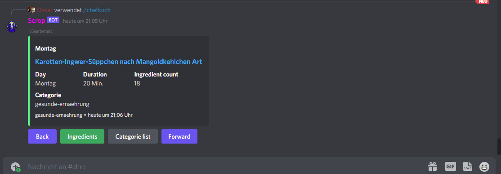

# chefkoch discord bot
This project is an discord bot which render/display recipes from [chefkoch.de](https://chefkoch.de).
The recipes are gathered using another script and stored locally in .json files.

[Recipe gathering script](https://github.com/Oskar1504/chefkoch_scrap.git)

## Usage
Once u installed and created the bot you can enter /chefkoch week in the
chat and the bot should answer with an Menu where u can select the different categories.

## Installation
* clone repo
* create discord application
    * create discord bot
    * receive token
* create .env
```dotenv
DISCORD_TOKEN=<bot_token>
GUILD_ID=<guild_id>
CLIENT_ID=<bot_id>
```
* save .env
```bash
npm install
npm run dev
```

## Images




